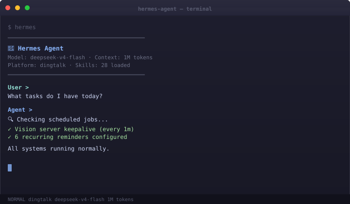
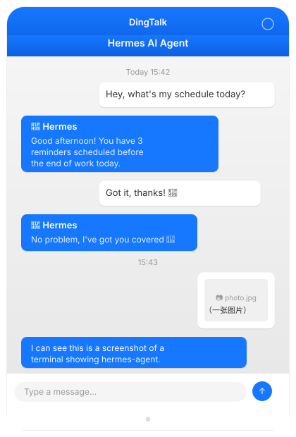

# AI-Agent-Local-Infrastructure

AI infrastructure for persistent local intelligence and multi-platform agent workflows.

## Features

- Local LLM inference
- Persistent memory system
- DingTalk messaging integration
- Vision reasoning server
- Automated task scheduling
- Cross-platform deployment (WSL)

## How it works

DingTalk receives user messages and forwards them to the local gateway.  
The gateway calls the local LLM, loads persistent memory, and returns responses through DingTalk.  
Vision requests are routed to the local vision server when image reasoning is required.

## Architecture

```
  User
    │
    ▼
┌─────────────┐
│  DingTalk   │
│    Bot      │
└──────┬──────┘
       │
       ▼
┌─────────────┐
│  Gateway    │
└──────┬──────┘
       │
       ▼
┌─────────────┐
│  Local LLM  │
└──────┬──────┘
       │
       ▼
┌─────────────┐
│   Memory    │
└──────┬──────┘
       │
       ▼
┌─────────────┐
│Vision Server│
└──────┬──────┘
       │
       ▼
┌─────────────┐
│  Scheduler  │
└─────────────┘
```

## Tech Stack

- Python 3.11+ (asyncio)
- FastAPI / Uvicorn
- SQLite (memory + scheduler)
- LM Studio (local LLM inference)
- Qwen2.5-VL-7B (vision reasoning)
- DingTalk Bot (messaging)
- Docker Compose
- NVIDIA RTX 4070 Super

## Screenshots

| Terminal CLI | DingTalk Chat | Vision API |
|:---:|:---:|:---:|
|  |  |  |

DingTalk agent running locally with persistent memory, vision reasoning, and scheduled reminders.

## Project Structure

```
gateway/          — Message gateway (FastAPI)
  server.py       — Main FastAPI application
  config.py       — Pydantic configuration model
  dingtalk.py     — DingTalk bot client
  llm_client.py   — OpenAI-compatible LLM client

vision/           — Vision analysis client
  __init__.py     — VisionClient for local vision server

memory/           — Persistent memory store (SQLite)
  __init__.py     — MemoryStore with FTS5 search

scheduler/        — Async task scheduler
  __init__.py     — Cron-like scheduler with SQLite persistence

config.yaml.example  — Configuration template
docker-compose.yml  — Multi-service orchestration
Dockerfile           — Gateway container build
requirements.txt     — Python dependencies
```

## Contact

- Email: 2712247951@qq.com

## Related Projects

- [vision-server](https://github.com/TEAR5951/vision-server) — Local Vision AI API
- [local-llm-gateway](https://github.com/TEAR5951/local-llm-gateway) — Local LLM inference gateway
