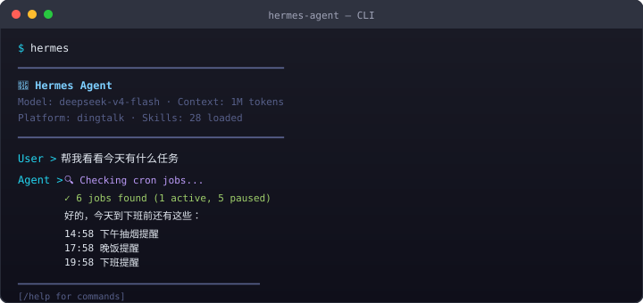
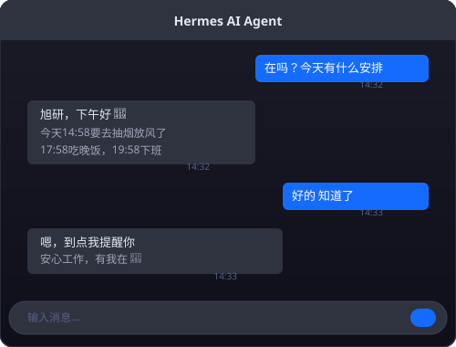
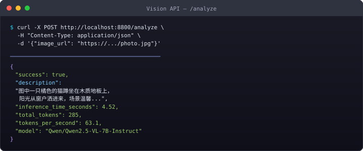

# AI-Agent-Local-Infrastructure

Local AI agent infrastructure with persistent memory, DingTalk integration, vision reasoning and workflow automation.

## Features

- Local LLM inference
- Persistent memory system
- DingTalk messaging integration
- Vision reasoning server
- Automated task scheduling
- Cross-platform deployment (WSL)

## How it works

DingTalk receives user messages, forwards them to the local gateway, calls the local LLM, reads persistent memory, and returns the response through DingTalk.

## Architecture

```
User
↓
DingTalk Bot
↓
Gateway
↓
Local LLM
↓
Memory System
↓
Vision Server
↓
Automation Scheduler
```

## Tech Stack

- Python
- Flask
- LM Studio
- Qwen2.5-VL-7B
- DingTalk Bot
- WSL
- RTX 4070 Super
- Cron

## Screenshots

| Terminal CLI | DingTalk Chat | Vision API |
|:---:|:---:|:---:|
|  |  |  |

## Project Structure

```
gateway/     — DingTalk messaging gateway configuration
vision/      — Local vision reasoning server (Qwen2.5-VL-7B)
memory/      — Persistent memory system
scheduler/   — Automated task scheduling (cron jobs)
README.md    — This file
```

## Related Projects

- [vision-server](https://github.com/TEAR5951/vision-server) — Local Vision AI API
- [local-llm-gateway](https://github.com/TEAR5951/local-llm-gateway) — Local LLM inference gateway
